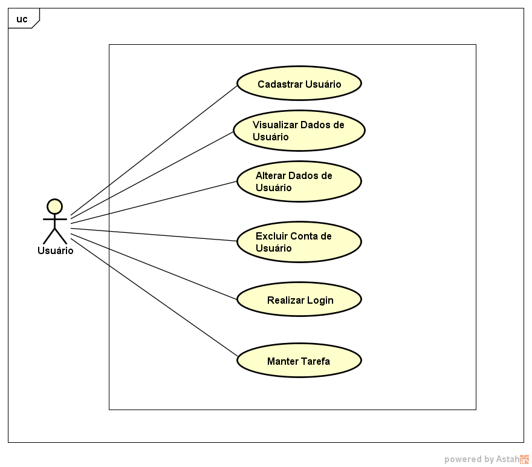
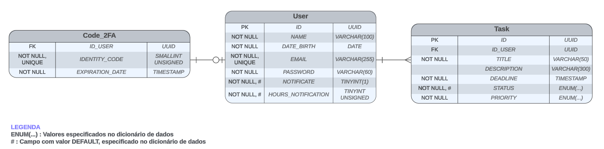
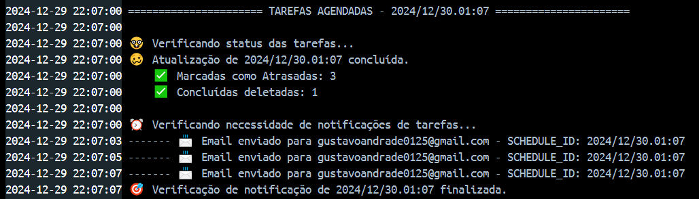
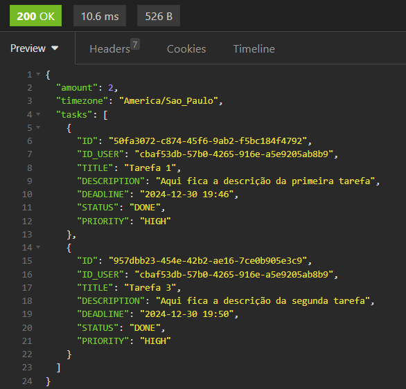

# ToDu System
---
## 📘 Sumário

- [🎒 Sobre o Projeto](#🎒-sobre-o-projeto)  
- [⚙ Funcionalidades e Modelos](#⚙-funcionalidades-e-modelos)  
- [🛠 Tecnologias e Ferramentas](#🛠-tecnologias-e-ferramentas)  
- [💻 Como Rodar Localmente](#💻-como-rodar-localmente)  
- [🎡 Exemplo de Uso](#🎡-exemplo-de-uso)  
- [👤 Desenvolvedor](#👤-desenvolvedor)

---
## 🎒 Sobre o Projeto


O `ToDu System` é um software desenvolvido para fixação dos meus conhecimentos em desenvolvimento de API's.


O sistema conta com suporte para manutenção de informações de `Usuários` e permite com que gerenciem suas `Tarefas`. Além disso, conta com `Autenticação em Duas Etapas` (entre outras medidas de segurança e criptografia de dados sensíveis) e com uma lógica de `envio automatizado de e-mails` para notificar os usuários sobre o prazo de suas tarefas e monitoração de seu estado. Um dos grandes diferenciais do sitema é lidar com `qualquer fuso horário` na manipulação das tarefas.

---
## ⚙ Funcionalidades e Modelos 
[🌟Documentação Completa do Sistema](https://www.notion.so/ToDu-System-1-0-0-d1e61f25fd204e17b6253c142b4e571c)

O sistema cumpre:





#### 💡 O dicionário de dados, regras de negócio, etc, podem ser consultados na [Documentação Completa](https://www.notion.so/ToDu-System-1-0-0-d1e61f25fd204e17b6253c142b4e571c)

Tendo o sistema rodando localmente, acesse a `Documentação com Swagger` :

    http://localhost:<PORTA>/docs


---

## 🛠 Tecnologias e Ferramentas

- *NodeJs + Express*: Construção do servidor

- *MySQL*: Banco de dados relacional

- *Knex*: Consultas ao banco de dados

- *Docker*: Ferramenta de DevOps para construir em 'conteiners'

- *UUID (Universally Unique IDentifier)*: Segurança em identificadores universalmente exclusivos

- *JWT (JSON Web Tokens)*: Autenticações com tokens

- *BCrypt*: Armazenamento do `salted hashes` de informações sensíveis

- *Joi*: Validação de entradas para operações com body

- *DateFNS*: Comparação e Manipulação completa de datas

- *Swagger*: Documentação da API

- *NodeMailer*: Envio de e-mails de verificação e notificações

- *NodeSchedule*: Agendamento de `operações automatizadas`
    
    - O que foi automatizado: O envio de emails para usuários quando o prazo das tarefas chega a uma distância pré-definida por ele, exclusão de tarefas concluídas cujo prazo já passou e controle do estado de tarefas para que ela seja marcada como atrasada se seu prazo passou.

- *NodeFetch*: Consumir a a API do `TimezoneDB` para mapear todos os fusos horários

- *Path e FS*: Caching local dos dados obtidos em consultas à API's externas para evitar processamento desnecessário


---
## 💻 Como rodar localmente

Clone o projeto:

```bash
  https://github.com/GustavoAndrad/ToDu_System.git
```

Entre no diretório do projeto:

```bash
  cd ToDy_System
```
! Não esqueça de preparar as `variáveis de ambiente definidas em .env.example` !

Instale as dependências:

```bash
  npm install
```

Construa os conteiners configurados:

```bash
  docker-compose -p todu_project up --build
  //Executando o compose passando um nome para o projeto
```

No prompt do conteiner `todu_app` 

```bash
    /home/app # npx knex migrate:latest --knexfile knexfile.cjs
    // Rodando as migrations redefinindo o knexfile para usar CommonJS
```

### Caso não use o Docker: 

Pule as etapas do Docker, rode as migartions e rode manualmente:

```bash
  npm run dev
  // Atenção às tecnologias aqui!
```

---
## 🎡 Exemplo de Uso

Saída no console sobre as `operações agendadas`:



Exemplo de uma `requisição no Insominia`:



---

## 👤 Desenvolvedor

- [@GustavoAndrad](https://www.github.com/GustavoAndrad) - Programador e Analista

